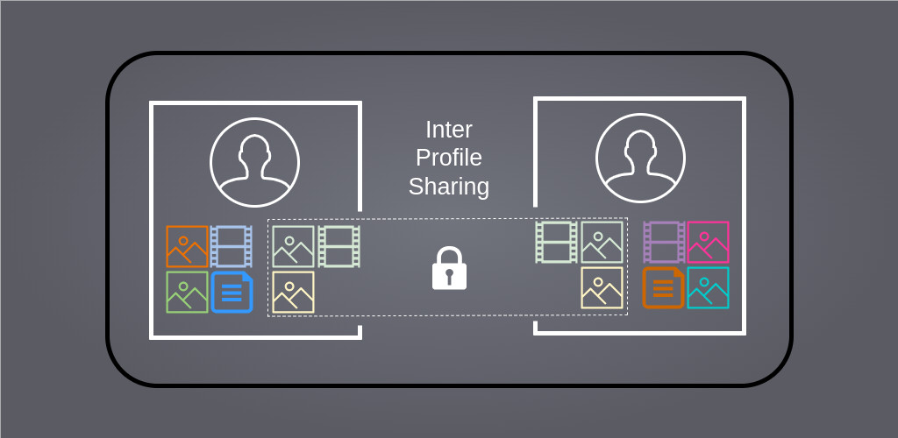
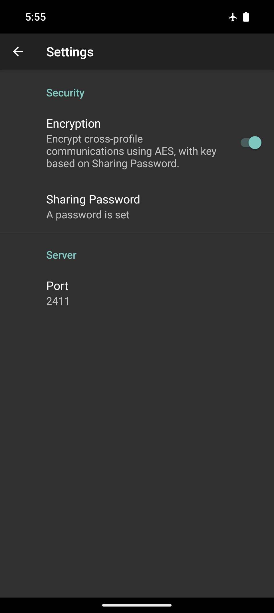
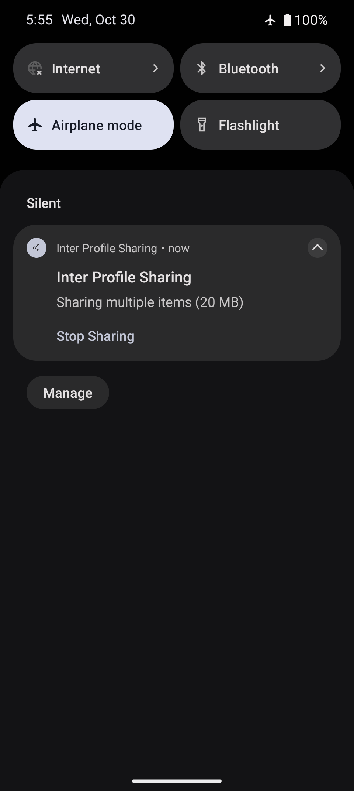

# Inter Profile Sharing

This is a purposefully simple, native App that allows forwarding media and text to another Android User Profile as easily as sharing it with another App.

No complicated setup. No fancy hacks. Well-established dependencies. Free Open Source Code.

Although this App will run on any Android 14+ phone, it was designed and tested for GrapheneOS which comes with various [**improvements to Android's User Profiles**](https://grapheneos.org/features#improved-user-profiles). Profiles allow isolating Apps from each other such that users are able to keep sensitive Applications separate from less trustworthy ones. Although GrapheneOS encourages their use, so much so that they raised the limit from 4 to 32 profiles per device, actually using them can be quite inconvenient. This App attempts to alleviate the arguably biggest pain point: The isolation of the file system between profiles, which requires less than optimal methods to bypass such as using USB Sticks, 3rd party Cloud Synchronization, or Messaging Apps to move files between profiles.

<a href="./metadata/en-US/images/phoneScreenshots/screenshot-main-activity.png" target="_blank"></a>
<a href="./metadata/en-US/images/phoneScreenshots/screenshot-settings-activity.png" target="_blank"></a>
<a href="./metadata/en-US/images/phoneScreenshots/screenshot-share-from-gallery.png" target="_blank"></a>
<a href="./metadata/en-US/images/phoneScreenshots/screenshot-server-notification.png" target="_blank"></a>
<a href="./metadata/en-US/images/phoneScreenshots/screenshot-client-notifications.png" target="_blank"></a>

## Usage

If you haven't, allow *multiple users* on your device by going into *Settings &raquo; System &raquo; Users*. You could create separate profiles for various types of Apps: Social Media, Encrypted Messengers, Banking, and maybe one for the bullshit App your gym forces you to have. Note though that switching between profiles can take several seconds. It's more convenient to have a profile containing all the Apps you often use during the day, and separate the others into different profiles.

Install this App within each profile that you want to share data with (no way around this, sorry). If you begin by installing this App within the Owner profile, you can easily install it into other profiles via *Install available apps* when editing a User.

## Security

### Permissions

* **Network**: When installing new applications on GrapheneOS, you'll be asked whether to allow it the *Network* permission. Although this App never connects to the Internet, it still requires this permission as its inter-profile communication depends on connecting over localhost (127.0.0.1).
* **Notifications**: This App makes use of notifications to inform you about information being shared by another User Profile. In fact, there's no UI from which you could obtain shared information other than notifications. This is why they're required. The App will never post any spam notifications unrelated to the information you're sharing.
* **Foreground Service**: The App will automatically obtain this permission upon installation, allowing it to serve shared information without getting killed by the system to save battery. Foreground Services are only used by this App while data is explicitly being shared. The user has full control over the running Service via a pinned notification.
* **Clipboard Write**: The App will automatically obtain this permission upon installation, allowing it to write to the clipboard. In fact, it even reads your clipboard, but it only ever does so when you click buttons explicitly stating this as a fact. This is used to conveniently share clipboard contents between User Profiles.

### Encryption

You can instantly start sharing files between profiles after installation, but it's recommended to turn on encryption within the App's settings. This requires setting **the same** *Sharing Password* within the App **in each profile**. Once configured, other applications running on your phone will not be able to access any of the data your sharing.

This feature is arguably paranoid. For another application to access information shared through this App, it would need to be explicitly programmed to do so. Enabling encryption will make data transfers slower, possibly less reliable, but it will certainly prevent such malicious Apps from accessing what you're sharing without your permission. Assuming you chose a nice, long password, that is.

### Download and Verification

The App's installation packages (APK files) can be found on the [Releases](https://github.com/VentralDigital/InterProfileSharing/releases) page. The .apk file can be downloaded and installed using your phone's browser. It may ask you to enable App installations from 3rd party sources first.

If you want to be sure you actually downloaded the real thing, you can first check whether the SHA-256 hash specified in the release matches with what the `sha256sum` command outputs locally. The APKs are built within an isolated development environment and signed therein. To verify the signature you can run the following command: 

```bash
apksigner verify --print-certs ips-1.0.apk | grep SHA-256
```

The output should match `03243d0c0d44b6e0b41e3cb245b1dc269be4c3ffe177f843fc005bc4ea0c7426`

## Troubleshooting

#### Android won't let me install the App

If you're attempting installation within a secondary User Profile it may be that you have disabled *"App installs and Updates"* for the current user. You can change this setting from the Owner profile at *Settings &raquo; System &raquo; Users*. If you're downloading it from your phone's browser, you may need to go into the App's settings and toggle on *"Allow from this source"* within the *Advanced* option called *"Install unknown apps"* found at *Settings &raquo; Apps &raquo; Your Browser App*. If the App is already installed on the device, even if it's in another user, the issue might stem from the APK files coming from different sources. You either need to re-download it from the same source as the first time, or uninstall the other version before installing the new one.

Android App installations are "Trust On First Use" (TOFU), meaning that the Android system will simply trust you to download and install a non-malicious package. The first package installation comes with a signature, based on which future installations (for updating the App, or re-installation within other user profiles) will be verified by. Depending on where you download the package from though, it may be that the App Store platform replaced the signature with their own.

The F-Droid store normally builds APK files from source and signs them with their own key. Because of TOFU this causes issues when Apps are installed from one source and updated from another. This App makes use of F-Droid's [Reproducible Builds](https://f-droid.org/en/docs/Reproducible_Builds/) feature, where, after they built the App from source, they compare it with the developer-signed APK file from the Releases page on GitHub. If they are equivalent, F-Droid publishes the official APK App instead, to prevent TOFU issues. 

#### I'm sharing something but I get no notification about it in the other profile

Often the background service checking for shared information from other profiles gets stopped by the system to save battery. In order to trigger the check manually, open the *Inter Profile Sharing* App and wait a second, or two.

Make sure that the sharing service actually keeps running after switching to another User Profile. If the *"something is being shared"* notification disappears after switching away and back, it might be that the user you're sharing from is not allowed to keep running in the background. You can change this within the user's settings at *Settings &raquo; System &raquo; Users*.

Note that the App can only communicate with itself in another profile, if they are both configured to use the same *Server Port* and, if you're using encryption, the same *Shared Password*.

#### The file I'm attempting to share keeps failing to download in the other profile

Have you checked whether the foreground service is actually still running after switching profiles? It might be that the notifications for new shared files appeared when you initially shared the files, but later the sharing service was stopped. This causes the notification about the shared file to remain, but the file itself is no longer available for transfer. See [above for solutions](#im-sharing-something-but-i-get-no-notification-about-it-in-the-other-profile).

This might also happen because your file is very large. If you're using encryption, it might be worth temporarily disabling it for transferring large files.

#### When I attempt to share something, the notification about it being shared immediately disappears again

This is most likely happening because it's aborting, due to a lack of permission to use notifications.

Another reason may be that the port is currently blocked by something else. When a new share is requested, but the port is already taken, the App sends a shutdown request to the sharing service of that other profile. This usually prevents forgotten shares from blocking new ones.

In the most rare cases it might be that the default port *2411* is being used by something else. In that case you may set a custom port within the App's settings. Note that this port needs to be set within all instances of this App, ie. in all profiles.

## Technical Details

Source files are located at `/app/src/main/java/digital/ventral/ips`:

* [**MainActivity.kt**](https://github.com/VentralDigital/InterProfileSharing/blob/main/app/src/main/java/digital/ventral/ips/MainActivity.kt) contains the UI shown when the App is opened.

The application supports sharing two basic types of items: Arbitrary files (*FILE* type) and short strings (*TEXT* type) such as clipboard contents or URLs. These are sourced either directly from the App's UI (buttons for picking a file, or copying from clipboard) or via Intents sent to the App from other applications (for example by sharing photos from the Gallery App or URLs from the Browser).

Upon receiving such a request to share information, the *MainActivity* invokes the *ServerService* which begins to listen for connection on the configured TCP Port.

* [**SettingsActivity.kt**](https://github.com/VentralDigital/InterProfileSharing/blob/main/app/src/main/java/digital/ventral/ips/SettingsActivity.kt) contains the UI shown when navigating to the App's settings.

Upon setting a *Shared Password* the *SettingsActivity* passes it to *EncryptionUtils* to derive an encryption key from it. The cleartext password is never actually stored. The settings user interface is build based on the specifications of the [*root_preferences.xml*](https://github.com/VentralDigital/InterProfileSharing/blob/main/app/src/main/res/xml/root_preferences.xml) file. 

* [**EncryptionUtils.kt**](https://github.com/VentralDigital/InterProfileSharing/blob/main/app/src/main/java/digital/ventral/ips/EncryptionUtils.kt) contains logic for creating and storing the encryption key derived from the *Shared Password*. It also contains the logic responsible for encrypting the inter-profile communication of this App.

The encryption key itself is stored within the App's preferences in an encrypted manner, mostly to prevent leaks when the device is rooted. The key is derived from the *Shared Password* string using hashing: `key = sha256(sha256(password) + DOMAIN_SEPARATOR)`.

The encryption itself is of type AES-GCM. It's mostly intended for the purpose of authentication, but it also prevents eavesdroppers from gaining any information from the traffic. Google's Tink library is used for efficient, hardware-accelerated encryption.

* [**ServerService**](https://github.com/VentralDigital/InterProfileSharing/blob/main/app/src/main/java/digital/ventral/ips/ServerService.kt) can also be referred to as the *sharing service* as it contains the logic actively sharing information from the profile its running in to other profiles.

The *ServerService* is intended to only be running while information is explicitly being shared, but during that, it runs as a foreground service to prevent the system from killing it to save battery. When the service boots it first checks whether the configured TCP port is available, and if not, it immediately sends a STOP_SHARING request to whatever is blocking it, in an attempt to obtain the port. This normally succeeds.

The *ServerService* then begins listening on the configured port for connections. In order to avoid the bloat of an HTTP server, the request-response based communication simply uses JSON encoded strings which are framed by newline characters. Currently 3 actions, or "methods" are supported by the server:

1. `SHARES_SINCE`: Sent by the client to check for new shared items. Each item contains the timestamp of when it was requested to be shared by the user. This timestamp is used during these requests to filter out items already seen by the client. Response is a JSON encoded array.
1. `FETCH_FILE`: Sent by the client to fetch the contents of a shared file. Response are the raw contents of the file.
1. `STOP_SHARING`: Sent by another server to request shutting down and freeing the port. Items shared by the server receiving this will become unavailable. No response.

As a foreground service, *ServerService* is required to maintain an active notification in order to prevent getting killed by the system. The service can be stopped either by swiping away this notification, or by explicitly tapping on it's *"Stop Sharing"* action button.

* [**ClientService**](https://github.com/VentralDigital/InterProfileSharing/blob/main/app/src/main/java/digital/ventral/ips/ClientService.kt) can also be referred to as *polling service* as it contains the logic that checks whether there's a *ServerService* running on the configured port and fetches lists and contents of shared items.

Checks for new items are skipped when (1) a check already was already triggered before within the same second, (2) the App is lacking the permission to post notifications, (3) the *ServerService* is running within the same profile, (4) it is unable to connect to the configured port.

Most of the other client logic is attempting to create pretty notifications for the information shared by another profile, and handling user interactions with these notifications.

If the user desires to do something with a shared file, it will always first be added to the Downloads folder. The App does not make use of any temporary directories or caches.

## Development & Translation

### Contribution

If you're looking to contribute changes to the code, I recommend locally cloning a fork of this repository and importing the project into AndroidStudio. If you're looking to contribute additions or corrections to the translations, you can use AndroidStudio as well, or just edit the raw translation files (If you don't understand the file format, try pasting them into ChatGPT and translate it with its help). The default language is `en-US` and texts from within the App are located at [`/app/src/main/res`](https://github.com/VentralDigital/InterProfileSharing/tree/main/app/src/main/res) within the `values` folders. Texts for App Stores are located in the [`/metadata`](https://github.com/VentralDigital/InterProfileSharing/tree/main/metadata) directory. After you've finished working on your changes, create a Pull Request into this repositories main branch. If all of this is too complicated, feel free to just [create an issue](https://github.com/VentralDigital/InterProfileSharing/issues/new) instead.

### Building & Signing a Release

#### F-Droid

First, increase `versionName` (eg. from 1.0 to 1.1) and `versionCode` (eg. from 1 to 2) within [`/app/build.gradle.kts`](https://github.com/VentralDigital/InterProfileSharing/blob/main/app/build.gradle.kts#L15-L16). Create a new changelog file `${versionCode}.txt` within [`/metadata/en-US/changelogs`](https://github.com/VentralDigital/InterProfileSharing/tree/main/metadata/en-US/changelogs).

Within the repository, execute the following commands to create a new build. Do NOT create a build from AndroidStudio, as this will likely not result in a [Reproducible Build](https://f-droid.org/en/docs/Reproducible_Builds/).

```bash
apt-get update && apt-get install -y librsvg2-bin openjdk-17-jdk-headless
update-alternatives --auto java
./gradlew assembleRelease
```

Next, sign the built APK file:

```bash
apksigner sign --ks path/to/your/keystore.jks --out signed.apk ./app/build/outputs/apk/release/app-release-unsigned.apk
```

Verify the signature, output should match `03243d0c0d44b6e0b41e3cb245b1dc269be4c3ffe177f843fc005bc4ea0c7426`

```bash
apksigner verify --print-certs app-release.apk | grep SHA-256
```

When creating a new release on GitHub, make sure that
- The release title exactly matches `versionName`
- The release creates a new tag, exactly matching `v${versionName}`
- The APK's file name exactly matches `ips-${versionName}.apk`

The [App's metadata in F-Droids repository](https://gitlab.com/fdroid/fdroiddata/-/blob/master/metadata/digital.ventral.ips.yml) is set to watch for new Git tags matching this pattern with binaries located at `https://github.com/VentralDigital/InterProfileSharing/releases/download/v%v/ips-%v.apk` (where `%v` is `versionName` and `%c` is `versionCode`)

To ensure builds are reproducible, the release tag should be exactly point to the state of the repository when the APK file was built. This will ensure that APK files rebuild based on the tag alone will match with the APK file specified in the release.

#### Play Store

The Google Play Store requires App Bundles (.aab) files instead of APKs. The commands are different, but the process is the same: We build, sign, and verify:

```bash
./gradlew bundleRelease
jarsigner -keystore path/to/your/keystore.jks app/build/outputs/bundle/release/app-release.aab key0
keytool -printcert -jarfile app/build/outputs/bundle/release/app-release.aab
```

In this case the `app-release.aab` file has been directly replaced with its signed version.

#### Accrescent

Accrescent requires an "APK Set" (a set of split APKs), which are .apks files. They are generated from AABs using the [`bundletool`](https://github.com/google/bundletool/releases):

```bash
java -jar bundletool-all-1.17.2.jar build-apks --bundle=app/build/outputs/bundle/release/app-release.aab --output=signed.apks --ks=path/to/your/keystore.jks --ks-key-alias=key0
unzip signed.apks -d extracted_signed_apks
find extracted_signed_apks/splits -name "*.apk" -exec apksigner verify --print-certs {} \; | grep SHA-256
rm -rf extracted_signed_apks
```